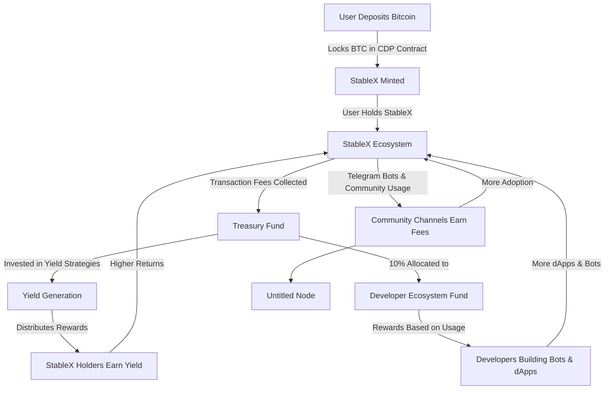

_🔹 Proposal: TeleStable – A CDP Stablecoin with Ecosystem Incentives_



## _🌟 Core Idea_

Imagine a stablecoin that you can mint by locking up Bitcoin as collateral, using a _Collateralized Debt Position (CDP)_ system.

What makes _TeleStable_ unique is that users pay a _small extra fee_ on transactions, which is collected by the protocol and used in two ways:

1️⃣ **Rewarding Stablecoin Holders**

- Part of the fees is used to generate yield (staking, lending, etc.).
- Yield is distributed to all stablecoin holders, meaning _passive income_ just for holding the stablecoin.

2️⃣ **Incentivizing Developers & Communities**

- A portion of fees funds a _Developer Ecosystem Fund (DEF)_.
- Developers who build Telegram bots and dApps using our stablecoin get rewards based on usage.
- Telegram channels integrating our bot (for group payments, rewards, etc.) earn a share of the fees.

---

## _⚙️ How It Works – Step by Step_

### _1️⃣ Minting the Stablecoin_

✅ _User Action:_ Deposit Bitcoin into our CDP smart contract.  
✅ _Collateral & Minting:_ If 200% over-collateralization is required:

- Deposit _$2,000_ worth of BTC → Mint _$1,000 StableX_ (stablecoin).  
  ✅ _Outcome:_ You hold _1,000 StableX_ pegged to $1 each while BTC stays as collateral.

---

### _2️⃣ Collecting Extra Protocol Fees_

📌 _Extra Fee Explained:_

- Normal BTC transaction fee goes to miners.
- Our protocol charges a _small additional fee_, captured in the Treasury.

📌 _Example Calculation:_

- If normal fee = _70 sat/byte_ and our baseline = _50 sat/byte_ → extra fee = _20 sat/byte_.
- For a _250-byte transaction_ with a _0.5% capture rate_:
  ```
  Extra Fee = 0.005 × 20 × 250 = 25 satoshis
  ```
- This extra fee (converted to USD) is stored in the Treasury.

---

### _3️⃣ Using the Treasury for Yield Generation_

💰 _Investing the Treasury:_

- Fees collected from deposits and dApp transactions are pooled into the Treasury.
- Funds are staked/lent in the _TON ecosystem_ to generate yield.

💰 _Yield Distribution:_

- If Treasury generates _$50 yield/week_ with _100,000 StableX_ in circulation:
- Holding _1,000 StableX_ earns you _$0.50/week_ in passive income.

---

### _4️⃣ Incentivizing Developers & Community Channels_

👨‍💻 _Developer Ecosystem Fund (DEF)_

- _10% of extra fees_ go to a special fund for developers.
- Devs building Telegram bots/dApps with StableX earn based on transaction volume.

📢 _Community Channel Incentives_

- Telegram channels using our bot for payments, rewards, etc., share in the fees.
- The more they engage, the more they earn.

---

## _📌 Example Summary_

🔹 _User Deposit:_ 0.05 BTC (_$2,000_) → Mint _$1,000 StableX_.  
🔹 _Extra Fee Capture:_ Transaction collects _25 satoshis_ (~$0.01) for Treasury.  
🔹 _Treasury Growth:_

- Daily extra fees total ~$800.
- _10% ($80) → Developer Fund_, _$720 → Yield Treasury_.  
  🔹 _Yield Generation:_ $50 yield in a week → Holding _1,000 StableX_ earns ~$0.50.  
  🔹 _Developer Rewards:_ If a dApp drives 50% of transactions, it gets _$40 from DEF_.

---

## _🚀 The Ecosystem Effect_

✅ More users = More fees collected.  
✅ Higher fees = Higher yield for stablecoin holders.  
✅ More developer rewards = More dApps & community adoption.

This creates a _virtuous cycle_ that boosts the value, usability, and adoption of _StableX_ across the _TON ecosystem_!
