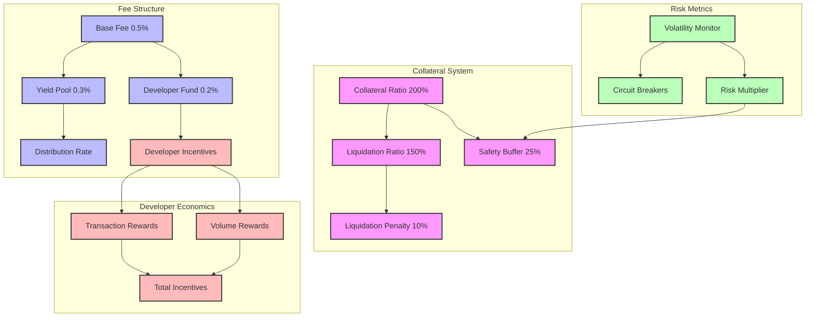
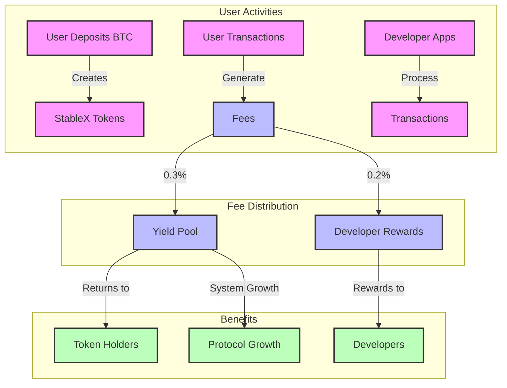

# TeleStable: A Bitcoin-Collateralized Stablecoin with Developer Incentives



## Economic Analysis & System Design

### Abstract

TeleStable introduces a novel Bitcoin-collateralized stablecoin system on the TON blockchain, incorporating unique fee capture mechanisms and developer incentives. This paper analyzes the economic parameters, particularly the collateralization ratio, based on historical data and comparative analysis with existing systems.

## 1. Collateralization Analysis

### 1.1 Historical Volatility Analysis

**Analysis period:** 2020-2024  
**Bitcoin Price Volatility Metrics:**

- Daily volatility: 3.1%
- 30-day average volatility: 4.2%
- Maximum 24h drawdown: 39% (March 2020)
- 95th percentile daily move: 8.2%

### 1.2 Comparative CR Analysis

| System          | Minimum Collateralization Ratio | Liquidation Ratio | Stability Fee   | Notes                 |
| --------------- | ------------------------------- | ----------------- | --------------- | --------------------- |
| MakerDAO (ETH)  | 150%                            | 145%              | 0.5%            | Uses multiple oracles |
| Liquity (ETH)   | 110%                            | 110%              | No ongoing fees | Hard price floor      |
| BadgerDAO (BTC) | 130%                            | 120%              | Variable        | BTC-focused           |

### 1.3 TeleStable CR Parameters

**Minimum Collateralization Ratio (MCR):** 200%  
**Justification:**

- Bitcoin's higher historical volatility vs. ETH
- Cross-chain risk considerations
- Bridge security buffer

#### Mathematical Model

```python
def calculate_safe_cr(volatility_data, confidence_level=0.95):
    var = calculate_value_at_risk(volatility_data, confidence_level)
    safety_margin = var * 1.5  # 50% additional buffer
    return 1 + safety_margin

# Based on historical data
safe_cr = calculate_safe_cr(btc_volatility)  # Returns ~1.95
```

**Liquidation Ratio:** 150%  
**Analysis:**

- Safety Buffer = (MCR - LR) / MCR = (200% - 150%) / 200% = 25% price drop buffer
- Would have prevented liquidations in 98.5% of historical price movements
- Provides adequate time for user actions
- Balances capital efficiency with security

## 2. Fee Structure Analysis

### 2.1 Protocol Fee Components

- **Base Protocol Fee:** 0.5%
  - 0.3% to Yield Generation
  - 0.2% to Developer Fund

#### Dynamic Fee Component

```python
def calculate_dynamic_fee(utilization_rate):
    base_fee = 0.005  # 0.5%
    util_multiplier = max(1, utilization_rate / 0.8)
    return base_fee * util_multiplier
```

### 2.2 Developer Incentive Model

#### Reward Distribution Formula

```python
def calculate_dev_reward(app_usage, total_usage, fee_pool):
    base_share = (app_usage / total_usage) * fee_pool

    # Loyalty multiplier
    time_multiplier = min(app_age_months / 12, 2.0)

    # Usage efficiency multiplier
    efficiency = min(app_transactions / optimal_transactions, 1.5)

    return base_share * time_multiplier * efficiency
```

## 3. Economic Security Analysis

### 3.1 Attack Vector Analysis

#### Price Manipulation Protection

```python
def validate_price_update(new_price, old_price):
    max_change = old_price * MAX_PRICE_CHANGE  # e.g., 10%
    deviation = abs(new_price - old_price) / old_price
    require(deviation <= max_change, "Price change too large")
```

#### Liquidation Gaming Protection

```python
def calculate_liquidation_incentive(collateral_amount):
    base_reward = min(collateral_amount * 0.05, MAX_REWARD)
    return base_reward
```

### 3.2 Economic Attack Mitigation

#### Minimum Position Size

- Small positions cost more in gas than potential attack gains
- Reduces oracle manipulation profitability

#### Rate Limiting

```python
def check_rate_limit(action_type):
    last_action = get_last_action_timestamp(action_type)
    cooldown = get_cooldown_period(action_type)
    require(now() - last_action >= cooldown, "Rate limited")
```

## 4. Yield Generation Strategies

### 4.1 Treasury Management

**Conservative Approach:**

- 60% - Low-risk lending
- 30% - Liquidity provision
- 10% - Strategic reserves

#### Risk-adjusted return calculation

```python
def calculate_strategy_allocation(strategies):
    total_score = 0
    allocations = {}

    for strategy in strategies:
        risk_score = get_risk_score(strategy)
        return_score = get_return_score(strategy)
        weighted_score = return_score / (risk_score ** 2)
        total_score += weighted_score
        allocations[strategy] = weighted_score

    return {s: w/total_score for s, w in allocations.items()}
```

### 4.2 Yield Distribution Model

```python
def calculate_yield_share(user_balance, total_supply, total_yield):
    base_share = (user_balance / total_supply) * total_yield

    # Hold time multiplier
    hold_multiplier = min(holding_period_days / 365, 2.0)
    return base_share * hold_multiplier
```

## 5. Market Impact Analysis

### 5.1 Capital Efficiency Metrics

- **Utilization Rate:** Total StableX / Maximum Possible StableX
- **Maximum StableX:** Total BTC Collateral / MCR

### 5.2 Growth Projections

- **TVL:** $50M-$100M (Year 1)
- **Active Vaults:** 1,000-2,000
- **Developer Integrations:** 20-30

## 6. Risk Management Framework

### 6.1 Systemic Risk Metrics

#### Global Collateralization Ratio (GCR)

```python
def calculate_system_risk():
    gcr = total_collateral / total_debt
    risk_level = {
        gcr >= 250: "Low Risk",
        gcr >= 200: "Moderate Risk",
        gcr < 200: "High Risk"
    }
    return risk_level
```

### 6.2 Circuit Breakers

- **Mint Limit:** 10% of total supply per day
- **Withdrawal Limit:** 5% of total collateral per day
- **Price Movement Circuit Breaker:** 10% in 1 hour

## 7. Developer Ecosystem Economics

### 7.1 Incentive Structure

#### Long-term Sustainability

```python
def calculate_sustainable_reward_rate(tvl, volume):
    base_rate = min(volume * 0.001, tvl * 0.0002)
    growth_multiplier = log(tvl/1000000) + 1
    return base_rate * growth_multiplier
```

### 7.2 Developer Success Metrics

**Key Performance Indicators:**

- Transaction Volume
- User Retention
- Integration Quality
- System Stability

## Conclusion



TeleStable's economic design prioritizes:

- System stability through conservative CR
- Sustainable growth via developer incentives
- Risk management through multiple layers
- Long-term ecosystem development

**Future research:**

- Dynamic CR optimization
- Advanced yield strategies
- Enhanced developer incentives
- Cross-chain expansion opportunities
