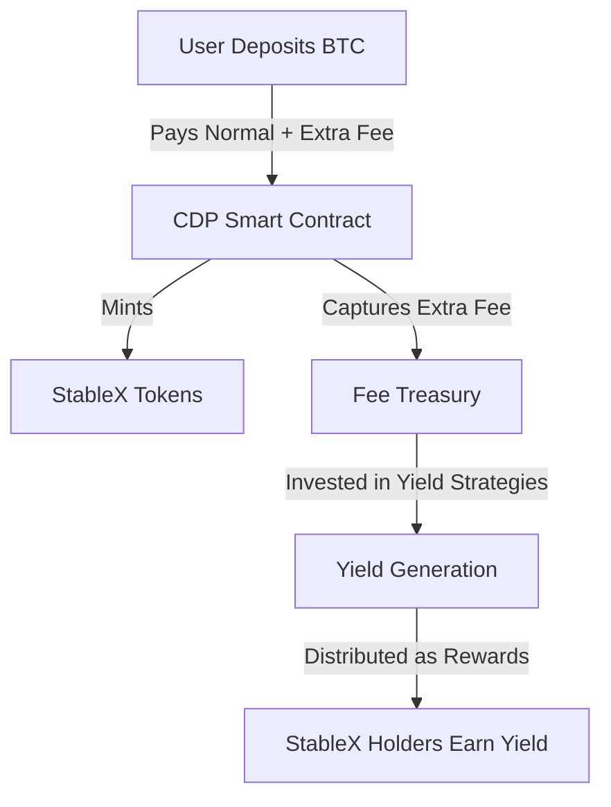
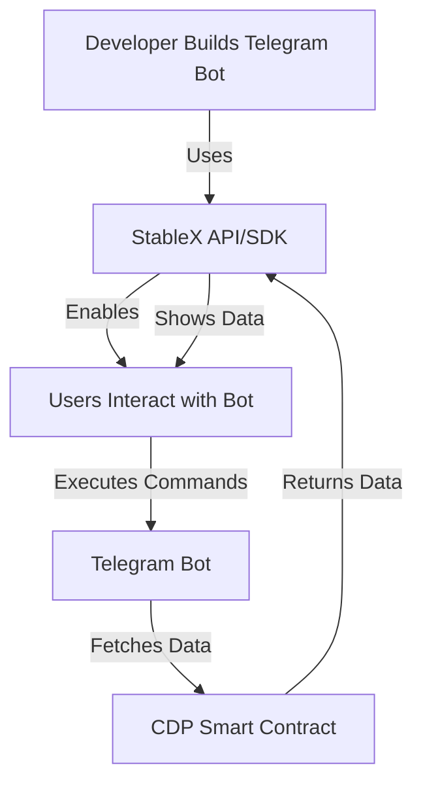
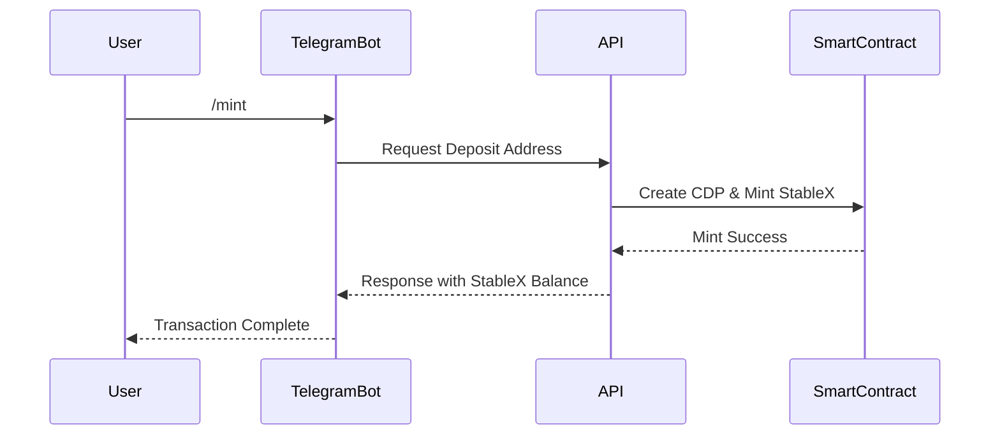
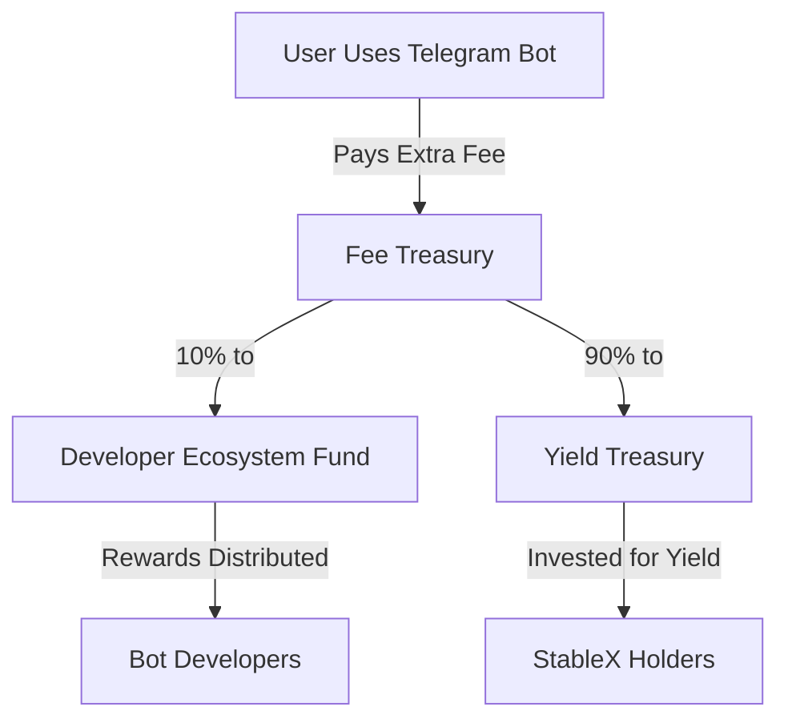
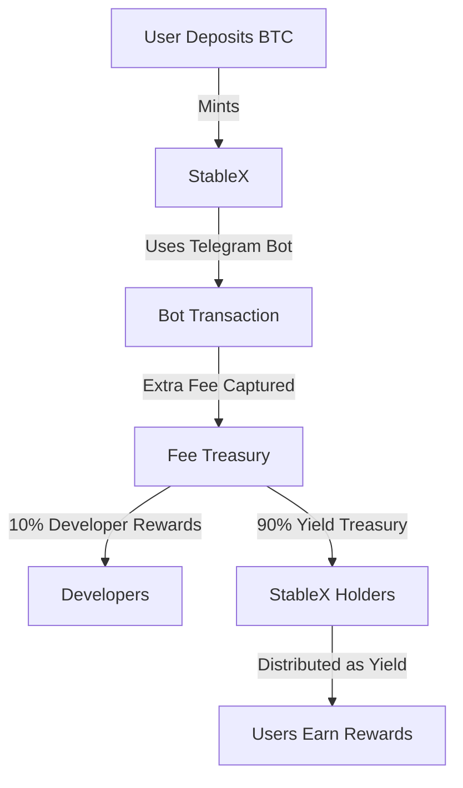

# **🔹 Why Use a BTC Fee-Based Mechanism for Our Protocol Fees?**

## **1️⃣ Why Use a BTC Fee-Based Mechanism?**

### **A. Rationale Behind Capturing Extra BTC Fees**

#### **📌 Market Signal & Value Capture**

- Bitcoin transaction fees fluctuate based on **network congestion** and **market volatility**.
- High fees indicate strong **user demand** for transactions.
- By capturing a small extra fee, we **convert high fees into revenue** for our protocol.

#### **📌 Economic Incentives**

- The **extra fee** (collected above the normal fee) is stored in a **Fee Treasury**.
- This **doesn’t take away from miners’ fees** but instead benefits the protocol.
- When Bitcoin network activity **increases**, our system captures **more revenue** → leading to **higher yield distribution** for stablecoin holders.

#### **📌 Sustainability & Scalability**

- A **small extra fee per transaction** scales naturally with **user adoption**.
- More transactions = **more fees** = **more yield** for all participants.
- Treasury funds are **reinvested** (staking, lending, etc.), making the system **self-sustaining**.

---

### **B. Example Calculation (Simplified Recap)**

- **Scenario**: User deposits BTC, paying both a **normal network fee** and an **extra protocol fee**.
- **Fee Breakdown**:

Current Bitcoin Fee: 70 sat/byte Baseline Fee: 50 sat/byte Difference: 20 sat/byte Transaction Size: 250 bytes Capture Rate: 0.5% (0.005)

Extra Fee Captured = 0.005 × 20 × 250 = 25 satoshis

- **Impact**:
- The **extra 25 satoshis** per transaction go into the **Fee Treasury**.
- Treasury grows over time and is used for **yield generation**.

---

---

## **2️⃣ Building a System on tgBTC for Developer Bots**

### **A. Concept Overview**

Our goal is to create a **TON blockchain-based ecosystem** where:  
✅ Users can **mint StableX** and manage their **CDP vaults**.  
✅ Developers can build **Telegram bots** and **dApps** using StableX.  
✅ Both **users & developers earn rewards** from **fees generated by dApp usage**.

---

### **B. How Developers Can Use Our Stablecoin in Their Bots**

#### **🛠️ Developer API / SDK**

We provide an **API/SDK** to allow **seamless integration** of StableX into Telegram bots.

#### **Key Functions:**

- 📥 **Deposit & Mint**: Users deposit BTC/tgBTC and mint StableX.
- 📊 **Check Balance & Health**: View CDP status, collateral ratio, and yield.
- 💸 **Transfer & Payments**: Facilitate StableX transfers.
- 📈 **Yield Monitoring**: Track yield rates and fee treasury balances.

The SDK is available in **JavaScript & Python**, making it easy for developers to integrate.

### **C. Telegram Bot / Mini-App Interface**

#### **🤖 Bot Features:**

- `/mint` → Guide users through **depositing BTC & minting StableX**.
- `/balance` → Show **StableX balance, collateral ratio, and accrued yield**.
- `/pay` → **Send StableX** to other Telegram users.
- `/earn` → Display **yield rewards & treasury balance**.

### **D. Incentive for dApp (Bot) Usage**

#### **💰 Revenue Sharing Model**

- Each interaction with a bot incurs a **small extra fee**.
- **Fees are split** into:
  - 📌 **Treasury Fund** (supports yield distribution).
  - 📌 **Developer Ecosystem Fund** (rewards developers).

#### **📈 Network Effect**

- More **bot transactions** → More **fees captured** → **Higher rewards for developers**.

#### **Example Calculation:**

If a popular bot processes **10,000 transactions/day** with a **$0.01 extra fee per transaction**:

Extra Revenue Per Day = 10,000 × $0.01 = $100
Developer Reward (10%) = $10/day

## 3️⃣ Putting It All Together – System Flow

